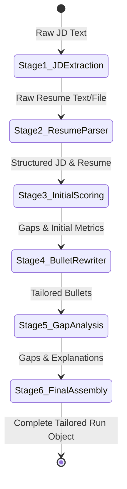

# Resume Shapeshifter — Architecture & Technical Design Document

This document provides a comprehensive technical architecture and design blueprint for **Resume Shapeshifter**, a JD-to-Resume tailoring engine. It translates the requirements outlined in the [Problem Statement](ProblemStatement.md) into a concrete, implementation-ready system architecture.

---

## 1. Executive Summary & Vision

**Resume Shapeshifter** is designed to solve a critical bottleneck for job seekers: the tedious, inconsistent, and highly error-prone process of manually tailoring resumes for specific job descriptions (JDs). 

Unlike generic resume builders or black-box ATS optimization tools, Resume Shapeshifter prioritizes **explainable matching**, **actionable gap analysis**, and **strict truthfulness guardrails**. The core output is a high-fidelity **Side-by-Side PDF Proof Artifact** that compares the original and tailored resumes side-by-side, showcasing match score increases, bullet-level rewrites, and gap analyses with clear disclaimers.

---

## 2. Core Value Proposition & System Objectives

The technical architecture is built around solving five key questions:
1. **Match Quantification:** How well does the current resume align with the JD? (Explainable score out of 100).
2. **Actionable Suggestions:** What concrete changes will improve alignment? (Bullet-level tailoring).
3. **Truthfulness and Ethics:** Can we guarantee the system never fabricates experiences, metrics, or credentials? (Deterministic and heuristic guardrails).
4. **Gap Transparency:** What crucial JD requirements are completely missing from the resume? (Insightful gap analysis).
5. **Verifiable Proof:** How can the user visually verify and trust the changes? (Side-by-side preview and dual PDF generation).

---

## 3. High-Level System Architecture

Resume Shapeshifter utilizes a decoupled, modern architecture comprised of a high-performance frontend SPA/SSR framework, a structured REST API layer with serverless route support, an LLM orchestration engine, and a reliable PDF generation pipeline.

### 3.1. Architecture Diagram (System Flow & Component Topology)

The diagram below outlines the end-to-end data lifecycle, from ingestion to PDF generation:

```mermaid
graph TD
    %% Define User / Client Interaction
    subgraph Client [Frontend SPA - Next.js / React]
        UI[User Interface]
        State[Session / Local State Store]
        PDFPreview[Side-by-Side Previewer]
    end

    %% Define Backend / Controller Layer
    subgraph API [Backend API - Next.js Routes / FastAPI]
        Router[API Gateway & Router]
        ParserService[Resume & JD Parsers]
        ScoringService[Scoring Engine]
        TailorService[LLM Orchestrator]
        GapService[Gap Analysis Engine]
        PDFGen[PDF Proof Engine]
    end

    %% Define External & System Integrations
    subgraph LLM [Structured GenAI Layer]
        LLMAgent[Structured LLM API - e.g., Gemini / Groq]
        PromptStore[Prompt Registry]
    end

    subgraph Data [Storage Layer - SQLite / Supabase]
        DB[(Local / Persistent DB)]
    end

    %% Data Flow Connections
    UserInput[User Uploads PDF/Docx or Pastes JD] --> UI
    UI -->|1. Raw Ingestion payload| Router
    Router -->|2. Extract Structure| ParserService
    ParserService -->|3. Parse Documents| LLMAgent
    LLMAgent -->|4. Structured JSON output| ParserService
    
    ParserService -->|5. Structured Data| Router
    Router -->|6. Calculate Initial Score & Gaps| ScoringService & GapService
    ScoringService & GapService -->|7. Original Metrics| Router
    
    Router -->|8. Request Tailored Rewrite| TailorService
    TailorService -->|9. Inject Prompts & Structure| LLMAgent
    LLMAgent -->|10. Bullet Metadata & Tailored JSON| TailorService
    
    TailorService -->|11. Tailored Resume & Explanations| Router
    Router -->|12. Final payload (Original vs Tailored)| UI
    UI -->|Save session state| State
    
    %% PDF Generation flow
    UI -->|13. Trigger Export| PDFGen
    PDFGen -->|14. Render PDF Stream| PDFPreview
    PDFGen -->|Save record| DB
```

---

## 4. Component Deep-Dive & Responsibilities

### 4.1. Frontend Layer (Next.js, React, Tailwind CSS, Shadcn UI)
The user interface is designed for high visual appeal, transparency, and micro-interactions.
*   **`Landing Page`:** Introduces the product, value proposition, and includes a one-click demo loaded with pre-configured samples (realistic software engineer resume + technical job description).
*   **`Ingestion Screen`:** Provides two drag-and-drop file uploaders (for PDF/DOCX resumes) alongside a rich textarea for pasting job description text (or optional URL scraping interface).
*   **`Analysis & Dashboard Screen`:** Presents the explainable match score before tailoring, extracted keywords, and a categorized gap list.
*   **`Side-by-Side Reviewer`:** The focal point of the application. Displays a split screen containing the **Original Resume** (left) and **Tailored Resume** (right). It highlights modified text, presents detailed hover tooltips explaining the *why* behind each rewrite, displays confidence scores (`high`, `medium`, `low`), and triggers risk warnings when appropriate.
*   **`Export & Download Module`:** Handles triggering and rendering of PDF generation with client-side loading states.

### 4.2. Ingestion & Document Parsing Service
Translates raw text or structured document binaries into unified JSON abstractions.
*   **Resume Parsers:** Utilizes libraries like `pdf-parse` (for PDF text extraction) and `mammoth` (for DOCX extraction), which are then piped into the LLM with a structural prompt to build a standard Zod-validated `ResumeProfile` JSON.
*   **JD Parser:** Extracts job title, company, requirements, tools, soft skills, and keyword frequencies.

### 4.3. Analysis & Match Engine
Evaluates the semantic distance between the parsed resume and the job description.
*   Determines overall and sub-category match scores (`skillCoverageScore`, `keywordScore`, etc.) based on standard text metrics combined with semantic embeddings (using vector cosine similarity or LLM evaluations).
*   Generates a qualitative, human-readable scoring narrative explaining exactly why the score was given.

### 4.4. LLM Tailoring Orchestrator
The core logic agent managing prompts, LLM state transitions, and structured JSON parsing.
*   Applies a pipelined prompt strategy to rewrite specific resume bullets, enforce truthfulness guardrails, generate metadata (changes reasons, confidence, risk metrics), and re-align summary sections.
*   Validates all LLM outputs against strict Zod schemas.

### 4.5. Gap & Recommendation Engine
Extracts requirements from the JD that are not adequately represented in the resume.
*   Computes missing skills, seniority gaps, and tool mismatches.
*   Maps each gap to a safe, actionable recommendation (e.g., "Add if true," "Mention in skills section," or "Prepare to explain during the interview").

### 4.6. PDF Generation Service
Renders high-quality PDF files.
*   Generates the **Standard Tailored Resume** (a clean, professional single-column resume optimized for ATS systems and human readers).
*   Generates the **Side-by-Side Proof Artifact** (a custom horizontal layout containing columns for original and tailored bullets, match metrics, gap summaries, and explicit disclaimers).
*   *Implementation options:* Next.js API route leveraging headless chrome via `Playwright`/`Puppeteer` or serverless-friendly `react-pdf`.

---

## 5. Structured Data Models (Zod & TypeScript Definitions)

Using Zod schemas ensures data integrity across API boundaries.

```typescript
import { z } from "zod";

// ==========================================
// 1. Resume Schema
// ==========================================
export const ContactSchema = z.object({
  fullName: z.string(),
  email: z.string().email().optional(),
  phone: z.string().optional(),
  location: z.string().optional(),
  links: z.array(z.string().url()).optional(),
});

export const WorkExperienceSchema = z.object({
  company: z.string(),
  title: z.string(),
  location: z.string().optional(),
  startDate: z.string(),
  endDate: z.string(), // "Present" or Date representation
  bullets: z.array(z.string()),
});

export const ProjectSchema = z.object({
  name: z.string(),
  description: z.string().optional(),
  bullets: z.array(z.string()),
  technologies: z.array(z.string()).optional(),
});

export const EducationSchema = z.object({
  institution: z.string(),
  degree: z.string(),
  fieldOfStudy: z.string().optional(),
  graduationDate: z.string(),
  gpa: z.string().optional(),
});

export const ResumeProfileSchema = z.object({
  contact: ContactSchema,
  summary: z.string().optional(),
  skills: z.array(z.string()),
  experience: z.array(WorkExperienceSchema),
  projects: z.array(ProjectSchema).optional(),
  education: z.array(EducationSchema),
  certifications: z.array(z.string()).optional(),
});

export type ResumeProfile = z.infer<typeof ResumeProfileSchema>;

// ==========================================
// 2. Job Description (JD) Schema
// ==========================================
export const JobDescriptionProfileSchema = z.object({
  jobTitle: z.string(),
  company: z.string().optional(),
  requiredSkills: z.array(z.string()),
  preferredSkills: z.array(z.string()),
  responsibilities: z.array(z.string()),
  qualifications: z.array(z.string()),
  tools: z.array(z.string()),
  keywords: z.array(z.string()),
  seniorityLevel: z.enum(["entry", "mid", "senior", "lead", "executive", "unknown"]),
  domainSignals: z.array(z.string()),
});

export type JobDescriptionProfile = z.infer<typeof JobDescriptionProfileSchema>;

// ==========================================
// 3. Match Score Schema
// ==========================================
export const MatchScoreSchema = z.object({
  overallScore: z.number().min(0).max(100),
  skillCoverageScore: z.number().min(0).max(100),
  responsibilityAlignmentScore: z.number().min(0).max(100),
  keywordScore: z.number().min(0).max(100),
  seniorityScore: z.number().min(0).max(100),
  criticalMissingRequirements: z.array(z.string()),
  explanation: z.string(),
});

export type MatchScore = z.infer<typeof MatchScoreSchema>;

// ==========================================
// 4. Tailored Resume & Metadata Schema
// ==========================================
export const TailoredBulletSchema = z.object({
  original: z.string(),
  tailored: z.string(),
  changeReason: z.string(),
  keywordsAddressed: z.array(z.string()),
  confidence: z.enum(["high", "medium", "low"]),
  riskFlag: z.string().optional(), // Warnings about potential overstatement
});

export const TailoredExperienceSchema = WorkExperienceSchema.extend({
  bullets: z.array(TailoredBulletSchema),
});

export const TailoredResumeSchema = z.object({
  tailoredSummary: z.string(),
  tailoredSkills: z.array(z.string()),
  tailoredExperience: z.array(TailoredExperienceSchema),
  tailoredProjects: z.array(ProjectSchema.extend({
    bullets: z.array(TailoredBulletSchema)
  })).optional(),
});

export type TailoredResume = z.infer<typeof TailoredResumeSchema>;

// ==========================================
// 5. Gap Analysis Schema
// ==========================================
export const ResumeGapSchema = z.object({
  name: z.string(),
  importance: z.enum(["high", "medium", "low"]),
  jdEvidence: z.string(), // Quote from JD
  resumeEvidence: z.string(), // Why we detected it as missing
  suggestedAction: z.string(), // "Add if you have this...", "Address in interview..."
  canSafelyAdd: z.boolean(), // Always false for fabrication prevention, unless user verifies
});

export const GapAnalysisSchema = z.object({
  gaps: z.array(ResumeGapSchema),
});

export type GapAnalysis = z.infer<typeof GapAnalysisSchema>;

// ==========================================
// 6. Complete Tailoring Run (Session State)
// ==========================================
export const TailoringRunSchema = z.object({
  runId: z.string().uuid(),
  timestamp: z.string(),
  originalResume: ResumeProfileSchema,
  jobDescription: JobDescriptionProfileSchema,
  originalMatch: MatchScoreSchema,
  tailoredMatch: MatchScoreSchema,
  tailoredResume: TailoredResumeSchema,
  gapAnalysis: GapAnalysisSchema,
});

export type TailoringRun = z.infer<typeof TailoringRunSchema>;
```

---

## 6. Detailed Pipeline & LLM Prompting Strategy

Resume Shapeshifter structures the complex tailoring process into a multi-stage sequential pipeline. This prevents "context drowning" and guarantees highly precise, schema-compliant JSON extraction.



### Stage 1: Job Description Feature Extraction
*   **Input:** Paste job description text.
*   **Engine Service:** LLM API.
*   **Prompt Strategy:** Instructs the LLM to act as an expert Technical Recruiter. Evaluates the text to extract core entities matching `JobDescriptionProfileSchema`.
*   **Enforced Output:** Strict JSON.

### Stage 2: Resume Parser & Section Builder
*   **Input:** Raw parsed plain text from PDF/Docx.
*   **Prompt Strategy:** Instructs the LLM to categorize raw unformatted resume text into distinct logical sections matching the standard `ResumeProfileSchema`. Resolves issues where two-column layout parsing disrupts standard reading order.
*   **Enforced Output:** Structured JSON matching `ResumeProfileSchema`.

### Stage 3: Initial Match & Explainable Scoring Engine
*   **Input:** Structured `ResumeProfile` and `JobDescriptionProfile`.
*   **Prompt Strategy:** Performs an honest audit. Computes keyword intersection, checks if core qualifications (degrees, years of experience) align, and lists missing critical elements.
*   **Enforced Output:** Matches `MatchScoreSchema`.

### Stage 4: Truthful Bullet-Level Rewriter
*   **Input:** `ResumeProfile` and `JobDescriptionProfile` + `MatchScore`.
*   **System Prompts & Rules:**
    *   *Rule 1 (Zero Fabrication):* Do **NOT** invent metrics, tools, certifications, or employers.
    *   *Rule 2 (Semantic Rephrasing):* Adapt vocabulary to map to the JD's preferred terms *if and only if* the candidate's original bullet supports that concept. (e.g., change "Managed server clusters on Amazon Web Services" to "Orchestrated AWS cloud infrastructure" to match a JD preferring "orchestrated cloud infrastructure").
    *   *Rule 3 (Verbs and Metrics):* Start with strong action verbs. Keep metrics exactly as they were in the original bullet.
    *   *Rule 4 (Metadata):* For every single bullet, output an explanation of the change, target keywords, confidence level, and a risk flag if the tailoring borders on exaggerating experience.
*   **Enforced Output:** JSON matching `TailoredResumeSchema`.

### Stage 5: Gap & Actionable Advice Engine
*   **Input:** `ResumeProfile`, `JobDescriptionProfile`, `TailoredResume`.
*   **Prompt Strategy:** Identifies required components from the job description that could **not** be integrated into the tailored resume because doing so would fabricate experience. Generates actionable advice for the candidate on how to handle these gaps.
*   **Enforced Output:** JSON matching `GapAnalysisSchema`.

### Stage 6: Final Resume Assembly & Validation
*   **Input:** Compiled components from preceding stages.
*   **Execution:** The Backend Orchestrator compiles all sections, calculates the revised **Tailored Match Score** by running the Tailored Resume back through the Stage 3 scoring engine, and validates the complete session object via Zod.

---

## 7. Truthfulness Guardrails & Ethical AI Design

The central product constraint is: **Resume Shapeshifter is a translation layer, not an experience generator.** The architecture implements multiple programmatic checks to enforce this:

1.  **Strict Prompt Boundaries:** The bullet-rewriting prompt starts with system-level constraints and uses zero-shot/few-shot examples demonstrating how to reject adding a technology if it is absent in the original resume.
2.  **Entity-Intersection Check (Static Code Validation):**
    *   The backend performs a deterministic intersection check. If a technology or tool appears in the `tailoredExperience` bullets but is not found anywhere in the `originalResume` (in experience, projects, or skills), the system raises a **High Risk** flag or strips the tool automatically.
3.  **Low-Confidence / Risk Flags in UI:** Rewrites that make logical inferences are flagged visually (`Confidence: Low` or `Risk: Experience overstatement warning`) forcing the user to review and confirm the block.
4.  **Proof Document Disclaimer:** The exported comparison PDF contains a prominent footer stating:
    > "Verification Proof: This tailored resume is a semantic optimization based on your uploaded experience. Fabricating metrics, credentials, or tools is ethically wrong and highly detrimental to interview success. Please verify all information before submission."

---

## 8. Side-by-Side Proof PDF Design & Layout Strategy

The **Side-by-Side Comparison PDF** is the primary validation artifact of the application. It acts as a professional record of changes.

```
+-----------------------------------------------------------------------------------+
|                        RESUME SHAPESHIFTER - PROOF REPORT                         |
|  Job Role: [Senior Frontend Engineer]        Company: [Enterprise Solutions Inc.]  |
+-----------------------------------------------------------------------------------+
|  Original Match Score: 52 / 100        ======>        Tailored Match Score: 88 / 100 |
|  Score Change Reason: Semantic rephrasing of core responsibilities, skill          |
|  re-ordering, and optimization of terminology matching target JD requirements.   |
+-----------------------------------------------------------------------------------+
|  JOB DESCRIPTION REQUIREMENTS SUMMARY                                             |
|  - Required: React, Next.js, TypeScript, CI/CD, CSS-in-JS, Responsive layouts.    |
|  - Preferred: Playwright testing, Cloud Deployment, Performance optimization.     |
+-----------------------------------------------------------------------------------+
|  EXPERIENCE BULLET COMPARISON LOG (Original vs Tailored)                          |
+------------------------------------+----------------------------------------------+
|  ORIGINAL BULLET                   |  TAILORED BULLET                             |
+------------------------------------+----------------------------------------------+
|  * Built client-facing websites    |  * Engineered responsive, highly performant  |
|    using React and styled-         |    React web applications utilizing          |
|    components.                     |    CSS-in-JS (styled-components).           |
|                                    |    [Change Reason: Aligns with JD's core    |
|                                    |     requirement for responsive architecture]  |
+------------------------------------+----------------------------------------------+
|  GAP & ADVICE LOG                                                                 |
|  - Playwright: High Priority Gap. The JD requires Playwright; your resume does not|
|    mention it. Action: Add if true; otherwise, prepare to discuss standard UI     |
|    testing strategies during your technical screen.                               |
+-----------------------------------------------------------------------------------+
|  DISCLAIMER: The candidate must review and verify all bullets before applying.    |
+-----------------------------------------------------------------------------------+
```

### Technical Ingestion & Generation Plan:
*   **CSS Layout:** Leverages a grid system mapping precisely to a standard landscape letter format (`11in x 8.5in`) for a clean dual-column presentation.
*   **Diff-Highlighting:** Highlights deleted phrases in light red (`bg-red-50 text-red-700`) and newly added phrases/keywords in light green (`bg-green-50 text-green-700`).

---

## 9. Security, Privacy & Data Storage

*   **Session-Only Privacy (Default):** For maximum privacy, resume data is kept in the client's local session memory (`localStorage` or `sessionStorage`). No user data is stored on backend disks unless explicitly authorized.
*   **Optional Database Storage:**
    *   **SQLite** for local development and self-hosted environments.
    *   **PostgreSQL / Supabase** for cloud deployment.
    *   *Schema Entities:* A `Users` table, a `Resumes` table (storing encrypted structured JSON), and a `TailoringRuns` table representing historical tailoring iterations.
*   **PII Sanitization:** The client-side parser can optionally mask standard PII (email, phone, address, exact location) before sending payloads to the LLM backend to protect user privacy.

---

## 10. Development Roadmap & Implementation Phases

The recommended path to building Resume Shapeshifter is divided into five iterative, vertical slices:

### Phase 1: Ingestion & Core UI Layout (The Sandbox)
*   Build the frontend SPA with Next.js, Tailwind CSS, and Shadcn UI.
*   Set up input views for pasting job descriptions and resume text.
*   Mock parser returns and render the static side-by-side component structure.

### Phase 2: Schema Validation & LLM Integration (The Pipeline)
*   Integrate Zod validation layers.
*   Implement the LLM routing controllers (`/api/parse-resume`, `/api/parse-jd`, `/api/score`, `/api/tailor`).
*   Establish LLM prompt templates inside `/prompts/` and guarantee strict JSON parsing of LLM outputs.

### Phase 3: Truthfulness Guardrail Implementation (The Shield)
*   Build the programmatic entity-matching service.
*   Develop deterministic filters that cross-reference resume skills with LLM outputs, immediately stripping hallucinated tools.
*   Add visual warning banners and hover metrics showing confidence levels.

### Phase 4: Side-by-Side PDF Export Engine (The Proof)
*   Develop the Landscape PDF styling template for the Proof Artifact.
*   Integrate a PDF generation library (e.g. `Playwright` or `react-pdf`) to compile and stream high-quality PDFs to the user.

### Phase 5: Production Polish & QA (The Launch)
*   Implement full loading skeletons, retry mechanisms, and API rate-limiting handling.
*   Package complete, realistic sample resumes and job listings directly in the UI as a "One-Click Demo" to showcase product capabilities immediately.

---

## 11. Risks, Technical Edge Cases & Mitigations

### 1. File Structure Parsing Failures
*   *Risk:* Complex, double-column PDF resumes parse as disjointed, alternating text blocks.
*   *Mitigation:* The prompt parsing pipeline explicitly handles multi-column reconstruction by asking the LLM to reconstruct the timeline chronologically before applying structured categorization.

### 2. LLM Hallucinations & Fabricated Achievements
*   *Risk:* The model invents impressive quantitative figures (e.g., "Increased revenue by 45%") to match generic optimization goals.
*   *Mitigation:* Explicit system instructions strictly forbid the generation of new numeric parameters. The parser audits numerical differences and throws error flags if any new metric numbers are discovered in tailored outputs.

### 3. Vague or Ambiguous Job Descriptions
*   *Risk:* The job description has minimal content (e.g., "Looking for a React developer, please apply"), causing the scoring and gap analysis to crash or output meaningless values.
*   *Mitigation:* The backend JD parsing engine validates the depth of the JD. If requirements are sparse, the UI prompts the user to add key technical requirements manually or fetch standard JD templates.

---

## 12. Conclusion & Next Steps

This architecture provides a scalable, highly secure, and highly transparent technical foundation for **Resume Shapeshifter**. 

Developers should begin by implementing **Phase 1: Ingestion & Core UI Layout**, starting with the typescript schema validations in `/lib/schemas.ts` and the main layout dashboard structure.
