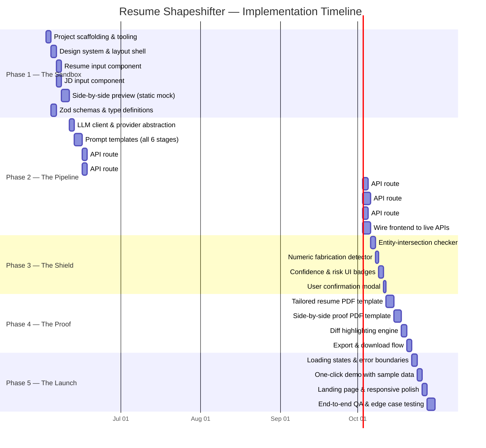
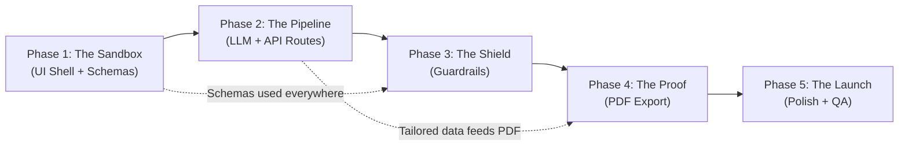
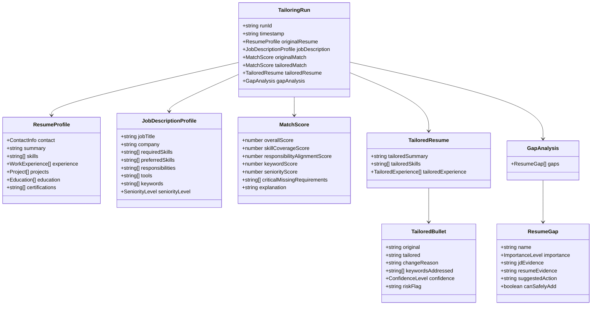
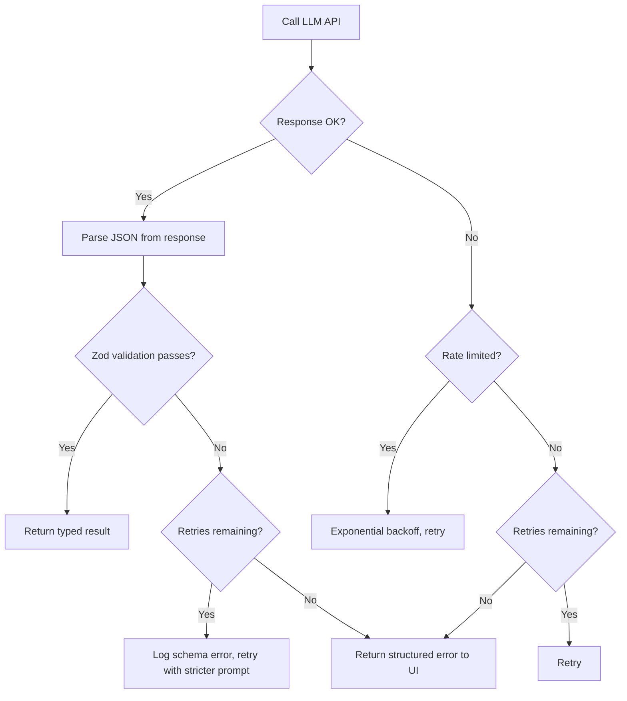
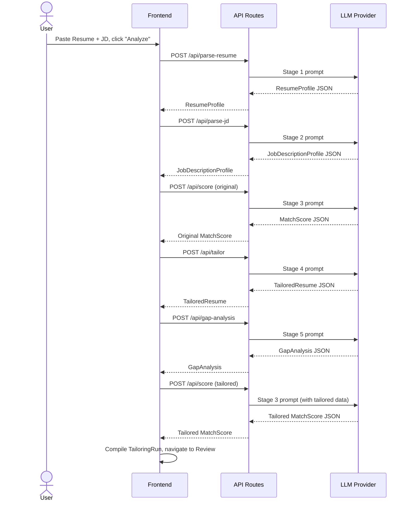

# Resume Shapeshifter — Phase-Wise Implementation Plan

> **Reference Documents:**
> - [Architecture & Technical Design](architecture.md)
> - [Problem Statement & Product Requirements](ProblemStatement.md)
>
> **Tech Stack:** Next.js 14 (App Router) · React 18 · TypeScript · Tailwind CSS · Shadcn UI · Zod · Groq / Gemini API · react-pdf / Playwright · pdf-parse · mammoth

---

## Implementation Overview

This plan decomposes the architecture into **5 sequential phases**, each delivering a self-contained vertical slice that can be independently demonstrated and tested. Every phase builds on the outputs of the previous phase.



### Phase Dependency Graph



---

## Phase 1: The Sandbox — Ingestion & Core UI Layout

**Goal:** Establish the project foundation, design system, all Zod type definitions, and a fully navigable UI shell with mock data rendering. By the end of this phase, a user can paste resume text and JD text and see a static side-by-side comparison powered by hardcoded sample data.

**Duration:** ~11 days

---

### 1.1 Project Scaffolding & Tooling

| Item | Detail |
|------|--------|
| **Task** | Initialize the Next.js 14 project with App Router, TypeScript, Tailwind CSS, and ESLint |
| **Command** | `npx -y create-next-app@latest ./ --typescript --tailwind --eslint --app --src-dir --import-alias "@/*"` |
| **Post-Init** | Install Shadcn UI CLI, initialize component library, install `zod` |

#### Files Created

| File Path | Purpose |
|-----------|---------|
| `src/app/layout.tsx` | Root layout with font loading (Inter/Outfit from Google Fonts), metadata, theme provider |
| `src/app/page.tsx` | Landing page entry point |
| `src/app/globals.css` | Tailwind directives + CSS custom properties for the design system |
| `tailwind.config.ts` | Extended color palette, fonts, animation keyframes |
| `components.json` | Shadcn UI configuration |
| `.env.local` | `GROQ_API_KEY` or `GOOGLE_API_KEY` placeholder |
| `.env.example` | Documented environment variable template |
| `tsconfig.json` | Path aliases (`@/components/*`, `@/lib/*`, `@/prompts/*`) |

#### Acceptance Criteria
- [ ] `npm run dev` starts without errors
- [ ] Tailwind utility classes render correctly
- [ ] Shadcn `Button` and `Card` components render with the custom theme
- [ ] Environment variable loading works via `process.env`

---

### 1.2 Design System & Global Layout Shell

| Item | Detail |
|------|--------|
| **Task** | Define the visual language: color tokens, typography scale, spacing, glass-morphism utilities, and micro-animation keyframes. Build the persistent app shell (header, navigation, footer). |

#### Design Tokens (CSS Custom Properties)

```css
/* Core palette — defined in globals.css */
--color-bg-primary: hsl(222, 47%, 7%);       /* Deep navy dark mode */
--color-bg-surface: hsl(222, 35%, 12%);       /* Card surfaces */
--color-bg-elevated: hsl(222, 30%, 16%);      /* Elevated panels */
--color-accent-primary: hsl(250, 90%, 65%);   /* Vibrant indigo */
--color-accent-secondary: hsl(175, 80%, 50%); /* Teal highlight */
--color-success: hsl(145, 65%, 45%);          /* Score improvement */
--color-danger: hsl(0, 75%, 55%);             /* Risk / gap flags */
--color-warning: hsl(38, 92%, 55%);           /* Medium confidence */
--color-text-primary: hsl(210, 20%, 95%);
--color-text-muted: hsl(215, 15%, 55%);
```

#### Files Created / Modified

| File Path | Purpose |
|-----------|---------|
| `src/app/globals.css` | Design tokens, glassmorphism `.glass-panel` utility, animation keyframes (`fadeInUp`, `shimmer`, `pulseGlow`) |
| `src/components/layout/AppShell.tsx` | Persistent header (logo, nav links), main content area, footer |
| `src/components/layout/Navbar.tsx` | Responsive top navigation bar with step indicator |
| `src/components/layout/StepIndicator.tsx` | Horizontal stepper showing the user's current workflow position (Input → Analyze → Review → Export) |

#### Acceptance Criteria
- [ ] Dark-mode interface renders with the defined color palette
- [ ] Glass-morphism panels display correctly
- [ ] Step indicator highlights the active step
- [ ] Layout is responsive on mobile (≥375px), tablet (≥768px), and desktop (≥1280px)

---

### 1.3 Zod Schemas & TypeScript Type Definitions

| Item | Detail |
|------|--------|
| **Task** | Implement all data model schemas defined in the architecture document as production-grade Zod definitions. These schemas will be the single source of truth for API request/response validation, LLM output parsing, and frontend type safety. |

#### Files Created

| File Path | Purpose |
|-----------|---------|
| `src/lib/schemas/resume.ts` | `ContactSchema`, `WorkExperienceSchema`, `ProjectSchema`, `EducationSchema`, `ResumeProfileSchema` |
| `src/lib/schemas/job-description.ts` | `JobDescriptionProfileSchema` |
| `src/lib/schemas/match-score.ts` | `MatchScoreSchema` |
| `src/lib/schemas/tailored-resume.ts` | `TailoredBulletSchema`, `TailoredExperienceSchema`, `TailoredResumeSchema` |
| `src/lib/schemas/gap-analysis.ts` | `ResumeGapSchema`, `GapAnalysisSchema` |
| `src/lib/schemas/tailoring-run.ts` | `TailoringRunSchema` (composite session object) |
| `src/lib/schemas/index.ts` | Barrel export for all schemas and inferred types |

#### Schema Relationships



#### Acceptance Criteria
- [ ] All 6 schema files export both Zod objects and inferred TypeScript types
- [ ] `TailoringRunSchema.parse(sampleData)` succeeds with complete mock data
- [ ] Invalid data throws clear, structured Zod errors
- [ ] Barrel export (`index.ts`) re-exports every schema and type

---

### 1.4 Resume Input Component

| Item | Detail |
|------|--------|
| **Task** | Build the resume ingestion interface supporting plain-text paste (MVP primary), PDF upload, and DOCX upload. |

#### Files Created

| File Path | Purpose |
|-----------|---------|
| `src/components/input/ResumeInput.tsx` | Main resume input component with tabbed interface (Paste Text / Upload File) |
| `src/components/input/FileUploader.tsx` | Reusable drag-and-drop file uploader with type validation (`.pdf`, `.docx`) and file size limits |
| `src/components/input/TextareaWithCounter.tsx` | Enhanced textarea with character count, auto-resize, and placeholder text |
| `src/lib/parsers/pdf-parser.ts` | Server-side PDF text extraction using `pdf-parse` |
| `src/lib/parsers/docx-parser.ts` | Server-side DOCX text extraction using `mammoth` |

#### Component Behavior
- **Text Paste:** A large, auto-resizing textarea with sample placeholder text showing the expected format
- **File Upload:** Drag-and-drop zone accepting `.pdf` and `.docx` files. Shows file name, size, and a preview of extracted text. Max file size: 5MB.
- **Validation:** Client-side file type and size validation before upload. Server-side text extraction returns plain text.
- **State Management:** Stores raw text in React state; cleared on reset.

#### Acceptance Criteria
- [ ] User can paste resume text into the textarea and it persists in state
- [ ] User can drag-and-drop or click-to-upload a PDF/DOCX file
- [ ] Uploaded file shows a preview of extracted text content
- [ ] Invalid file types show a clear error message
- [ ] A "Clear" button resets the input

---

### 1.5 Job Description Input Component

| Item | Detail |
|------|--------|
| **Task** | Build the JD ingestion interface. MVP supports pasted text only. |

#### Files Created

| File Path | Purpose |
|-----------|---------|
| `src/components/input/JDInput.tsx` | JD text input with a large textarea, sample placeholder showing a realistic JD snippet |

#### Acceptance Criteria
- [ ] User can paste JD text
- [ ] Textarea auto-resizes to content
- [ ] Placeholder contains a realistic 3-4 line JD sample
- [ ] A "Clear" button resets the JD input

---

### 1.6 Side-by-Side Preview (Static Mock Data)

| Item | Detail |
|------|--------|
| **Task** | Build the side-by-side comparison view that will later display original vs tailored resume content. Initially powered by hardcoded mock data to validate the layout and UX. |

#### Files Created

| File Path | Purpose |
|-----------|---------|
| `src/components/review/SideBySideDiff.tsx` | Two-column layout: original bullets (left) vs tailored bullets (right), with highlighted changes |
| `src/components/review/BulletComparison.tsx` | Individual bullet row showing original, tailored, change reason, confidence badge, and risk flag |
| `src/components/review/ConfidenceBadge.tsx` | Color-coded badge (`high` = green, `medium` = amber, `low` = red) |
| `src/components/analysis/ScoreCard.tsx` | Animated circular score gauge displaying a score out of 100 with sub-score breakdown |
| `src/components/analysis/ScoreComparison.tsx` | Horizontal before → after score display with animated transition arrow |
| `src/components/analysis/GapAnalysisPanel.tsx` | Categorized gap list with importance badges and suggested actions |
| `src/components/analysis/JDSummaryCard.tsx` | Displays extracted JD requirements, skills, and tools as categorized tag chips |
| `src/lib/mock-data/sample-resume.ts` | Realistic software engineer resume as a `ResumeProfile` object |
| `src/lib/mock-data/sample-jd.ts` | Realistic Senior Frontend Engineer JD as a `JobDescriptionProfile` object |
| `src/lib/mock-data/sample-tailoring-run.ts` | Complete mock `TailoringRun` object connecting all schemas |

#### Layout Blueprint

```
┌─────────────────────────────────────────────────────────┐
│  Step Indicator:  [Input]  [Analyze]  ● Review  [Export] │
├─────────────────────────────────────────────────────────┤
│  ┌──────────────────┐     ┌──────────────────┐          │
│  │  Original Score   │ ──▶ │  Tailored Score   │          │
│  │      52/100       │     │      88/100       │          │
│  └──────────────────┘     └──────────────────┘          │
├─────────────────────────────────────────────────────────┤
│  JD Summary: React · Next.js · TypeScript · CI/CD ···    │
├──────────────────────┬──────────────────────────────────┤
│   ORIGINAL RESUME    │       TAILORED RESUME             │
├──────────────────────┼──────────────────────────────────┤
│  • Built websites    │  • Engineered responsive React    │
│    using React...    │    web applications...            │
│                      │    ✏️ Reason: Aligns with JD      │
│                      │    🟢 Confidence: High            │
├──────────────────────┴──────────────────────────────────┤
│  GAP ANALYSIS                                            │
│  🔴 Playwright (High) — Add if you have experience       │
│  🟡 Cloud Deployment (Medium) — Mention if familiar      │
└─────────────────────────────────────────────────────────┘
```

#### Acceptance Criteria
- [ ] Side-by-side view renders with mock data
- [ ] Score cards animate from 0 to the target number
- [ ] Bullet comparisons display original and tailored text
- [ ] Confidence badges render with correct colors
- [ ] Gap analysis panel shows categorized gaps with importance badges
- [ ] JD summary displays extracted requirements as tag chips
- [ ] Layout is responsive (stacks vertically on mobile)

---

### 1.7 Page Assembly & Routing

| Item | Detail |
|------|--------|
| **Task** | Assemble the pages using the Next.js App Router and wire the step-based navigation. |

#### Files Created / Modified

| File Path | Purpose |
|-----------|---------|
| `src/app/page.tsx` | Landing page with hero section, value proposition, and "Get Started" CTA |
| `src/app/input/page.tsx` | Resume + JD input page (side-by-side or stacked inputs) |
| `src/app/analyze/page.tsx` | Analysis results: JD summary, original score, gaps |
| `src/app/review/page.tsx` | Side-by-side comparison view |
| `src/app/export/page.tsx` | Export options and download buttons |
| `src/lib/store/tailoring-store.ts` | Zustand or React Context store managing `TailoringRun` session state across pages |

#### Acceptance Criteria
- [ ] Navigation flows linearly: Landing → Input → Analyze → Review → Export
- [ ] Step indicator updates correctly on each page
- [ ] State persists across page transitions via the global store
- [ ] Back navigation works without data loss

---

### Phase 1 Deliverable Summary

> **Demo:** A fully navigable, visually polished UI shell where a user can paste resume and JD text, click "Analyze," and see a static side-by-side comparison populated from hardcoded mock data. All Zod schemas are implemented and validated. The design system is established with dark-mode, glass-morphism, and smooth animations.

---

## Phase 2: The Pipeline — LLM Integration & API Routes

**Goal:** Replace all mock data with live LLM-powered processing. By the end of this phase, pasting a real resume and JD produces real structured analysis, scoring, tailored bullets, and gap analysis via a 6-stage LLM pipeline.

**Duration:** ~17 days

**Prerequisites:** Phase 1 complete (UI shell, schemas, mock data flow)

---

### 2.1 LLM Client & Provider Abstraction

| Item | Detail |
|------|--------|
| **Task** | Create a provider-agnostic LLM client that abstracts away the specifics of Groq, Google Gemini, or any structured-output-capable model. Supports JSON mode, temperature control, and retry logic. |

#### Files Created

| File Path | Purpose |
|-----------|---------|
| `src/lib/llm/client.ts` | `LLMClient` class with `generateStructuredOutput<T>(prompt, schema)` method. Handles retries (3 attempts), exponential backoff, and Zod validation of the response. |
| `src/lib/llm/providers/groq.ts` | Groq-specific adapter using `@groq/sdk` or standard OpenAI-compatible SDK pointing to Groq |
| `src/lib/llm/providers/gemini.ts` | Google Gemini adapter using `@google/generative-ai` SDK with JSON schema mode |
| `src/lib/llm/index.ts` | Factory function that reads `LLM_PROVIDER` env var and returns the correct adapter |
| `src/lib/llm/types.ts` | Shared types: `LLMProvider`, `LLMConfig`, `LLMResponse<T>` |

#### Error Handling Strategy



#### Acceptance Criteria
- [ ] `LLMClient.generateStructuredOutput()` returns Zod-validated typed objects
- [ ] Invalid JSON from the LLM triggers automatic retry (up to 3 times)
- [ ] Rate limiting (429) triggers exponential backoff
- [ ] Provider switching works via environment variable without code changes
- [ ] Errors surface as structured objects, not raw exceptions

---

### 2.2 Prompt Templates (All 6 Pipeline Stages)

| Item | Detail |
|------|--------|
| **Task** | Create modular, testable prompt templates for each stage of the pipeline. Each prompt file exports a function that accepts typed input and returns the system + user prompt strings. |

#### Files Created

| File Path | Pipeline Stage | Input Types | Output Schema |
|-----------|---------------|-------------|---------------|
| `src/prompts/jd-extraction.ts` | Stage 1 | `rawJDText: string` | `JobDescriptionProfileSchema` |
| `src/prompts/resume-parser.ts` | Stage 2 | `rawResumeText: string` | `ResumeProfileSchema` |
| `src/prompts/match-scoring.ts` | Stage 3 | `ResumeProfile, JobDescriptionProfile` | `MatchScoreSchema` |
| `src/prompts/bullet-rewriter.ts` | Stage 4 | `ResumeProfile, JobDescriptionProfile, MatchScore` | `TailoredResumeSchema` |
| `src/prompts/gap-analysis.ts` | Stage 5 | `ResumeProfile, JobDescriptionProfile, TailoredResume` | `GapAnalysisSchema` |
| `src/prompts/index.ts` | — | Barrel export | — |

#### Prompt Design Principles (from Architecture §6 & §7)

Each prompt template follows a consistent structure:

```typescript
// Example: src/prompts/bullet-rewriter.ts

export function buildBulletRewriterPrompt(
  resume: ResumeProfile,
  jd: JobDescriptionProfile,
  initialScore: MatchScore
): { system: string; user: string } {
  return {
    system: `You are an expert resume coach...
    
    ABSOLUTE RULES:
    1. NEVER invent metrics, tools, certifications, or employers.
    2. ONLY rephrase using vocabulary from the candidate's original content.
    3. If a JD keyword matches the candidate's experience, use the JD's 
       preferred terminology. If it does NOT match, do NOT add it.
    4. Keep all original numeric metrics EXACTLY as-is.
    5. For each bullet, provide: original, tailored, changeReason, 
       keywordsAddressed, confidence (high/medium/low), and riskFlag.
    6. Output STRICT JSON matching the provided schema.`,
    
    user: `## Candidate's Resume\n${JSON.stringify(resume)}
    \n## Target Job Description\n${JSON.stringify(jd)}
    \n## Current Match Assessment\n${JSON.stringify(initialScore)}
    \n## Task: Rewrite the experience bullets...`
  };
}
```

#### Acceptance Criteria
- [ ] Each prompt function is pure (no side effects, no API calls)
- [ ] Each prompt explicitly specifies the output JSON schema in the system message
- [ ] Bullet rewriter prompt contains all 4 truthfulness rules from Architecture §7
- [ ] Prompts are independently testable with mock inputs

---

### 2.3 API Route: Resume Parser (`/api/parse-resume`)

| Item | Detail |
|------|--------|
| **Task** | Create a Next.js API route that accepts raw resume text (or file upload), pipes it through the LLM resume parser prompt, and returns a validated `ResumeProfile`. |

#### Files Created

| File Path | Purpose |
|-----------|---------|
| `src/app/api/parse-resume/route.ts` | POST handler: accepts `{ rawText: string }` or `FormData` with file, returns `ResumeProfile` |

#### Request / Response Contract

```typescript
// POST /api/parse-resume
// Request Body:
{ rawText: string }  // OR FormData with file field

// Response (200):
{ success: true, data: ResumeProfile }

// Response (422 - Validation Error):
{ success: false, error: string, details: ZodError }

// Response (500 - LLM Error):
{ success: false, error: string, retryable: boolean }
```

#### Processing Flow
1. If file uploaded → extract text using `pdf-parse` or `mammoth`
2. Send extracted text to LLM with `resume-parser` prompt
3. Parse LLM response JSON
4. Validate against `ResumeProfileSchema`
5. Return validated object

#### Acceptance Criteria
- [ ] Plain text input returns a valid `ResumeProfile`
- [ ] PDF file upload extracts text and returns a valid `ResumeProfile`
- [ ] DOCX file upload extracts text and returns a valid `ResumeProfile`
- [ ] Malformed LLM output triggers retry and eventually returns a clear error
- [ ] Empty input returns a 400 error

---

### 2.4 API Route: JD Parser (`/api/parse-jd`)

| Item | Detail |
|------|--------|
| **Task** | Create a Next.js API route that accepts raw JD text, extracts structured features via LLM, and returns a validated `JobDescriptionProfile`. |

#### Files Created

| File Path | Purpose |
|-----------|---------|
| `src/app/api/parse-jd/route.ts` | POST handler: accepts `{ rawText: string }`, returns `JobDescriptionProfile` |

#### Request / Response Contract

```typescript
// POST /api/parse-jd
// Request: { rawText: string }
// Response (200): { success: true, data: JobDescriptionProfile }
```

#### JD Depth Validation (from Architecture §11.3)
- If the extracted JD has fewer than 2 required skills and 0 responsibilities, the API returns a warning:
  ```json
  { "success": true, "data": {...}, "warnings": ["JD appears sparse. Consider adding more detail for better matching."] }
  ```

#### Acceptance Criteria
- [ ] Real JD text returns a fully populated `JobDescriptionProfile`
- [ ] Sparse JDs return a warning alongside partial results
- [ ] Seniority level is correctly identified (entry/mid/senior/lead/executive)
- [ ] Keywords are deduplicated and normalized

---

### 2.5 API Route: Match Scoring (`/api/score`)

| Item | Detail |
|------|--------|
| **Task** | Create a scoring API route that evaluates a `ResumeProfile` against a `JobDescriptionProfile` and returns an explainable `MatchScore`. |

#### Files Created

| File Path | Purpose |
|-----------|---------|
| `src/app/api/score/route.ts` | POST handler: accepts `{ resume: ResumeProfile, jd: JobDescriptionProfile }`, returns `MatchScore` |

#### Scoring Dimensions (from Architecture §4.3)

| Dimension | Weight | Description |
|-----------|--------|-------------|
| `skillCoverageScore` | 30% | % of required + preferred skills found in resume |
| `responsibilityAlignmentScore` | 25% | Semantic match between JD responsibilities and resume bullets |
| `keywordScore` | 20% | Raw keyword overlap between JD keywords/tools and resume text |
| `seniorityScore` | 15% | Alignment of implied seniority (years, titles, scope) |
| `criticalMissing` penalty | 10% | Deduction for each critical missing requirement |

#### Acceptance Criteria
- [ ] Score is a number between 0 and 100
- [ ] Each sub-score is independently explainable
- [ ] The `explanation` field is a 2-4 sentence human-readable narrative
- [ ] The same inputs produce consistent scores (±5 variance acceptable due to LLM non-determinism)
- [ ] A perfect-match resume scores ≥ 90

---

### 2.6 API Route: Tailoring Engine (`/api/tailor`)

| Item | Detail |
|------|--------|
| **Task** | Create the core tailoring API route. This is the most complex route — it rewrites resume bullets with full metadata including change reasons, confidence levels, and risk flags. |

#### Files Created

| File Path | Purpose |
|-----------|---------|
| `src/app/api/tailor/route.ts` | POST handler: accepts `{ resume, jd, initialScore }`, returns `TailoredResume` |

#### Prompt Injection Rules (from Architecture §6, Stage 4)

The system prompt for this route MUST include:
1. **Rule 1 (Zero Fabrication):** Do NOT invent metrics, tools, certifications, or employers
2. **Rule 2 (Semantic Rephrasing):** Adapt vocabulary only where the original bullet supports the concept
3. **Rule 3 (Metrics Preservation):** Keep all numerical values exactly as-is from the original
4. **Rule 4 (Metadata):** Every bullet must include `changeReason`, `keywordsAddressed`, `confidence`, and `riskFlag`

#### Acceptance Criteria
- [ ] Each original bullet has a corresponding tailored bullet
- [ ] `changeReason` explains why each bullet was changed
- [ ] `keywordsAddressed` lists the specific JD keywords targeted
- [ ] `confidence` is one of `high`, `medium`, or `low`
- [ ] No new numeric metrics appear in the tailored bullets that weren't in the originals
- [ ] Skills section is reordered to prioritize JD-relevant skills
- [ ] Summary section is rewritten to align with the JD

---

### 2.7 API Route: Gap Analysis (`/api/gap-analysis`)

| Item | Detail |
|------|--------|
| **Task** | Create the gap analysis API route that identifies JD requirements that could NOT be safely addressed through tailoring. |

#### Files Created

| File Path | Purpose |
|-----------|---------|
| `src/app/api/gap-analysis/route.ts` | POST handler: accepts `{ resume, jd, tailoredResume }`, returns `GapAnalysis` |

#### Suggested Action Categories (from ProblemStatement §7.6)

| Action Type | When Used |
|-------------|-----------|
| "Add if you have this experience" | Skill exists but wasn't mentioned |
| "Leave out if not true" | Skill does not exist in resume |
| "Mention in skills section if familiar" | Light familiarity may exist |
| "Add a project bullet if applicable" | Could be covered by a side project |
| "Prepare to address in interview" | Critical gap that can't be covered on paper |

#### Acceptance Criteria
- [ ] Every required JD skill not covered in the tailored resume appears as a gap
- [ ] Each gap has an importance level, JD evidence quote, and actionable suggestion
- [ ] `canSafelyAdd` is `false` by default (user must verify)
- [ ] Gaps are sorted by importance (high → medium → low)

---

### 2.8 Wire Frontend to Live APIs

| Item | Detail |
|------|--------|
| **Task** | Replace all mock data calls with live API integrations. Build the orchestration layer that chains the 6 pipeline stages in the correct order. |

#### Files Created / Modified

| File Path | Purpose |
|-----------|---------|
| `src/lib/api/client.ts` | Typed API client with `fetch` wrappers for each endpoint |
| `src/lib/api/orchestrator.ts` | Pipeline orchestrator: chains parse → score → tailor → gap-analysis → re-score in sequence |
| `src/app/input/page.tsx` | **Modified:** "Analyze" button triggers the orchestrator |
| `src/app/analyze/page.tsx` | **Modified:** Displays live JD summary, original score, and gaps |
| `src/app/review/page.tsx` | **Modified:** Displays live side-by-side comparison |
| `src/components/ui/LoadingOverlay.tsx` | Full-page loading overlay with stage progress indicator ("Parsing resume…", "Scoring match…", "Tailoring bullets…") |

#### Orchestration Sequence



#### Acceptance Criteria
- [ ] Full pipeline executes end-to-end with a real resume and JD
- [ ] Loading overlay shows accurate stage progress
- [ ] Errors at any stage are caught and displayed to the user
- [ ] The complete `TailoringRun` object is stored in the session state
- [ ] Navigating to the Review page shows live data

---

### Phase 2 Deliverable Summary

> **Demo:** A user pastes a real resume and a real job description, clicks "Analyze," and after a loading sequence the app displays: a live JD analysis, an original match score with explanation, tailored resume bullets with per-bullet metadata, a gap analysis with actionable recommendations, and a tailored match score showing improvement. All data is produced by the LLM in real-time.

---

## Phase 3: The Shield — Truthfulness Guardrails

**Goal:** Add programmatic guardrails that catch and flag potential fabrications, hallucinations, or overstatements in the LLM output. By the end of this phase, users see visual warnings on risky rewrites and must confirm flagged content before exporting.

**Duration:** ~6 days

**Prerequisites:** Phase 2 complete (live LLM pipeline)

---

### 3.1 Entity-Intersection Checker (Static Code Validation)

| Item | Detail |
|------|--------|
| **Task** | Build a deterministic post-processing service that cross-references technologies, tools, and skills in the tailored resume against those present anywhere in the original resume. Any entity appearing in the tailored version but NOT in the original is flagged as a potential fabrication. |

#### Files Created

| File Path | Purpose |
|-----------|---------|
| `src/lib/guardrails/entity-checker.ts` | `checkEntityIntersection(original: ResumeProfile, tailored: TailoredResume): EntityViolation[]` — Extracts all named entities (technologies, tools, frameworks, certifications) from the original resume and compares against tailored bullets |
| `src/lib/guardrails/types.ts` | `EntityViolation`, `GuardrailResult`, `GuardrailSeverity` types |

#### Algorithm

```
1. Extract entity set from original resume:
   - All skills[]
   - All technologies from projects[]
   - All tools/technologies mentioned in experience bullets
   - All certifications
   → originalEntities: Set<string>

2. Extract entity set from tailored resume:
   - All tailoredSkills[]
   - All keywords from tailoredExperience bullets
   → tailoredEntities: Set<string>

3. newEntities = tailoredEntities - originalEntities

4. For each newEntity:
   - If it's a technology/tool → FLAG as "Potential fabrication: [entity] not found in original resume"
   - If it's a certification → STRIP and flag as "Removed: Certification not in original"
   - If it's a soft skill → WARN but allow
```

#### Acceptance Criteria
- [ ] A tailored bullet mentioning "Kubernetes" when the original resume has no Kubernetes reference produces a `HIGH` severity flag
- [ ] Soft skill additions produce `LOW` severity warnings
- [ ] The checker runs in < 50ms (no LLM call, pure string matching)
- [ ] Results are returned as a typed array of `EntityViolation` objects

---

### 3.2 Numeric Fabrication Detector

| Item | Detail |
|------|--------|
| **Task** | Build a detector that compares all numeric values in original vs tailored bullets. Any new number that wasn't present in the original is flagged. |

#### Files Created

| File Path | Purpose |
|-----------|---------|
| `src/lib/guardrails/numeric-checker.ts` | `checkNumericFabrication(original: string[], tailored: TailoredBullet[]): NumericViolation[]` — Regex-extracts all numbers from original and tailored bullets, flags any new numbers |

#### Acceptance Criteria
- [ ] Original: "Improved load time by 30%" → Tailored: "Improved load time by 30%" = ✅ No flag
- [ ] Original: "Built APIs" → Tailored: "Built 15 APIs serving 1M users" = 🚨 Flag both "15" and "1M"
- [ ] Common non-metric numbers (dates, version numbers) are excluded from detection

---

### 3.3 Confidence & Risk Badges in UI

| Item | Detail |
|------|--------|
| **Task** | Enhance the `BulletComparison` component to visually display guardrail results. Flagged bullets get prominent warning banners. |

#### Files Modified

| File Path | Changes |
|-----------|---------|
| `src/components/review/BulletComparison.tsx` | Add risk flag banner, entity violation warning, numeric fabrication alert. Flagged bullets have a yellow/red left border. |
| `src/components/review/RiskBanner.tsx` | **New:** Inline warning banner with icon, message, and "I confirm this is accurate" checkbox |
| `src/components/review/GuardrailSummary.tsx` | **New:** Top-of-page summary showing total flags: X high-risk, Y medium-risk, Z low-risk |

#### Visual Treatment

| Severity | Border | Badge | Icon |
|----------|--------|-------|------|
| High Risk | `border-l-4 border-red-500` | 🔴 `bg-red-100 text-red-800` | ⚠️ Shield with X |
| Medium Risk | `border-l-4 border-amber-500` | 🟡 `bg-amber-100 text-amber-800` | ⚡ Lightning |
| Low Risk | `border-l-4 border-blue-500` | 🔵 `bg-blue-100 text-blue-800` | ℹ️ Info circle |
| Safe | `border-l-4 border-green-500` | 🟢 `bg-green-100 text-green-800` | ✅ Checkmark |

#### Acceptance Criteria
- [ ] High-risk bullets display a prominent red warning banner
- [ ] The guardrail summary shows aggregate counts at the top of the review page
- [ ] Each flagged bullet has a "I confirm this is accurate" checkbox
- [ ] Unconfirmed high-risk bullets prevent PDF export (with override option)

---

### 3.4 User Confirmation Modal

| Item | Detail |
|------|--------|
| **Task** | Before export, if any high-risk flags are unconfirmed, show a modal requiring the user to acknowledge the risks. |

#### Files Created

| File Path | Purpose |
|-----------|---------|
| `src/components/review/ConfirmationModal.tsx` | Modal listing all unresolved high-risk flags with checkboxes. "I have reviewed and verified all flagged content" button enables export. |

#### Acceptance Criteria
- [ ] Modal blocks export when unconfirmed high-risk flags exist
- [ ] Each flag shows the specific concern and the affected bullet
- [ ] User can confirm individual flags or "confirm all"
- [ ] After confirmation, export proceeds normally

---

### Phase 3 Deliverable Summary

> **Demo:** After tailoring, the review page now shows guardrail results. Bullets containing technologies not found in the original resume are flagged with red banners. New numeric metrics trigger fabrication warnings. A guardrail summary at the top shows aggregate risk counts. Users must confirm flagged content before exporting. The system actively prevents unreviewed fabrications from reaching the final PDF.

---

## Phase 4: The Proof — PDF Export Engine

**Goal:** Generate two high-quality PDFs: a clean tailored resume and a comprehensive side-by-side proof artifact. By the end of this phase, users can download both PDFs from the export page.

**Duration:** ~10 days

**Prerequisites:** Phase 3 complete (guardrails implemented)

---

### 4.1 Tailored Resume PDF Template

| Item | Detail |
|------|--------|
| **Task** | Build a clean, single-column, ATS-friendly PDF template for the tailored resume. |

#### Files Created

| File Path | Purpose |
|-----------|---------|
| `src/lib/pdf/tailored-resume-template.tsx` | React component designed for PDF rendering (using `@react-pdf/renderer` or HTML-to-PDF via Playwright) |
| `src/lib/pdf/styles.ts` | Shared PDF styles: fonts, colors, spacing, page margins |
| `src/lib/pdf/fonts.ts` | Font registration (Inter or similar professional sans-serif) |

#### Template Layout (Portrait, Letter Size 8.5" × 11")

```
┌──────────────────────────────────────┐
│  CANDIDATE NAME                      │
│  email · phone · location · links    │
├──────────────────────────────────────┤
│  SUMMARY                             │
│  [Tailored summary paragraph]        │
├──────────────────────────────────────┤
│  SKILLS                              │
│  React · TypeScript · Next.js · ...  │
├──────────────────────────────────────┤
│  EXPERIENCE                          │
│  Company Name — Title    Start–End   │
│  • Tailored bullet 1                 │
│  • Tailored bullet 2                 │
│  • Tailored bullet 3                 │
├──────────────────────────────────────┤
│  PROJECTS                            │
│  Project Name                        │
│  • Tailored bullet                   │
├──────────────────────────────────────┤
│  EDUCATION                           │
│  Degree — Institution     Year       │
├──────────────────────────────────────┤
│  CERTIFICATIONS                      │
│  Cert 1 · Cert 2                     │
└──────────────────────────────────────┘
```

#### Acceptance Criteria
- [ ] PDF renders with professional typography (no default browser fonts)
- [ ] Single-column layout is ATS-scanner friendly
- [ ] Content fits within standard letter-size margins (0.75" all sides)
- [ ] Multi-page resumes handle page breaks gracefully
- [ ] PDF file size is under 500KB

---

### 4.2 Side-by-Side Proof PDF Template

| Item | Detail |
|------|--------|
| **Task** | Build the landscape-oriented proof artifact PDF matching the layout specified in Architecture §8. |

#### Files Created

| File Path | Purpose |
|-----------|---------|
| `src/lib/pdf/proof-report-template.tsx` | React component for the side-by-side comparison PDF |

#### Template Layout (Landscape, Letter Size 11" × 8.5")

```
┌───────────────────────────────────────────────────────────────┐
│                 RESUME SHAPESHIFTER — PROOF REPORT             │
│  Role: [Job Title]                  Company: [Company Name]    │
├───────────────────────────────────────────────────────────────┤
│  Original Score: XX/100    ═══▶    Tailored Score: YY/100      │
│  Score Explanation: [narrative]                                 │
├───────────────────────────────────────────────────────────────┤
│  JD REQUIREMENTS SUMMARY                                       │
│  Required: skill1, skill2, ...    Preferred: skill3, skill4    │
├────────────────────────┬──────────────────────────────────────┤
│  ORIGINAL              │  TAILORED                             │
├────────────────────────┼──────────────────────────────────────┤
│  • Original bullet 1   │  • Tailored bullet 1                  │
│                        │    Reason: [explanation]               │
│                        │    Confidence: High 🟢                │
├────────────────────────┼──────────────────────────────────────┤
│  • Original bullet 2   │  • Tailored bullet 2                  │
│                        │    Reason: [explanation]               │
│                        │    ⚠️ Risk: [warning]                 │
├────────────────────────┴──────────────────────────────────────┤
│  GAP ANALYSIS                                                  │
│  🔴 [Gap 1] — High — [Action]                                 │
│  🟡 [Gap 2] — Medium — [Action]                               │
├───────────────────────────────────────────────────────────────┤
│  DISCLAIMER: The candidate must review and verify all content  │
│  before applying. This is a semantic optimization, not a       │
│  fabrication tool.                                             │
└───────────────────────────────────────────────────────────────┘
```

#### Acceptance Criteria
- [ ] Landscape PDF renders with the dual-column comparison layout
- [ ] Score comparison prominently shows before → after with visual arrow
- [ ] Each bullet pair shows the change reason and confidence level
- [ ] Risk-flagged bullets are visually marked in the PDF
- [ ] Gap analysis section is included at the bottom
- [ ] Disclaimer footer appears on every page
- [ ] Multi-page reports handle page breaks cleanly

---

### 4.3 Diff Highlighting Engine

| Item | Detail |
|------|--------|
| **Task** | Build a text-diff engine that highlights the specific words/phrases that changed between original and tailored bullets in the proof PDF. |

#### Files Created

| File Path | Purpose |
|-----------|---------|
| `src/lib/pdf/diff-engine.ts` | `computeWordDiff(original: string, tailored: string): DiffSegment[]` — Returns an array of segments marked as `unchanged`, `added`, or `removed` |
| `src/lib/pdf/DiffHighlightedText.tsx` | React component that renders `DiffSegment[]` with color-coded spans (red for removed, green for added) |

#### Color Scheme
- **Removed text:** `background: hsl(0, 80%, 93%)` + `color: hsl(0, 65%, 40%)` + strikethrough
- **Added text:** `background: hsl(145, 65%, 90%)` + `color: hsl(145, 55%, 25%)`
- **Unchanged text:** default color

#### Acceptance Criteria
- [ ] Word-level diffing correctly identifies added, removed, and unchanged segments
- [ ] Diff renders correctly in both the web preview and the PDF
- [ ] Performance: diff of a 200-word bullet completes in < 10ms

---

### 4.4 Export & Download Flow

| Item | Detail |
|------|--------|
| **Task** | Build the export page with download buttons for both PDFs. Implement the PDF generation API route. |

#### Files Created / Modified

| File Path | Purpose |
|-----------|---------|
| `src/app/api/generate-pdf/route.ts` | POST handler: accepts `TailoringRun` + `pdfType: "resume" | "proof"`, returns PDF blob |
| `src/app/export/page.tsx` | **Modified:** Two download cards — "Download Tailored Resume" and "Download Proof Report" with preview thumbnails |
| `src/components/export/PDFPreviewCard.tsx` | Card component showing a miniature PDF preview with download button |
| `src/components/export/DownloadButton.tsx` | Animated download button with progress indicator |

#### Acceptance Criteria
- [ ] "Download Tailored Resume" produces a clean, ATS-friendly PDF
- [ ] "Download Proof Report" produces the landscape side-by-side comparison PDF
- [ ] Both PDFs download with descriptive filenames: `[Name]_Tailored_Resume_[Company].pdf` and `[Name]_Proof_Report_[Company].pdf`
- [ ] Download buttons show loading state during PDF generation
- [ ] Generated PDFs open correctly in all major PDF readers

---

### Phase 4 Deliverable Summary

> **Demo:** The export page now offers two downloadable PDFs. The tailored resume PDF is a clean, professional, ATS-friendly document. The proof report PDF is a comprehensive landscape document showing the side-by-side comparison with diff-highlighted bullets, score comparison, gap analysis, and ethical disclaimers. Both PDFs are production-quality.

---

## Phase 5: The Launch — Production Polish & QA

**Goal:** Transform the functional prototype into a polished, demo-ready product with professional UX, error handling, a one-click demo mode, and comprehensive edge-case testing.

**Duration:** ~9 days

**Prerequisites:** Phase 4 complete (PDF export working)

---

### 5.1 Loading States & Error Boundaries

| Item | Detail |
|------|--------|
| **Task** | Add skeleton loaders, progress indicators, and graceful error handling throughout the application. |

#### Files Created / Modified

| File Path | Purpose |
|-----------|---------|
| `src/components/ui/SkeletonCard.tsx` | Animated shimmer skeleton matching card layouts |
| `src/components/ui/StageProgress.tsx` | Pipeline stage progress indicator: "✅ Parsed Resume → ✅ Parsed JD → 🔄 Scoring → ⬜ Tailoring → ⬜ Gap Analysis" |
| `src/components/ui/ErrorBoundary.tsx` | React error boundary with retry button and error details |
| `src/components/ui/ErrorCard.tsx` | Inline error display card with specific error messages and suggested fixes |
| `src/app/error.tsx` | Next.js global error page |
| `src/app/not-found.tsx` | Custom 404 page |

#### Error Handling Matrix

| Error Type | User-Facing Message | Action |
|------------|---------------------|--------|
| LLM rate limit | "Our AI is temporarily busy. Retrying..." | Auto-retry with countdown |
| LLM invalid JSON | "Processing error. Retrying with refined instructions..." | Auto-retry (up to 3x) |
| LLM timeout | "The analysis is taking longer than expected..." | Show cancel + retry options |
| Network error | "Connection lost. Please check your internet." | Show retry button |
| Invalid file format | "This file type is not supported. Please upload PDF or DOCX." | Highlight valid formats |
| Empty input | "Please paste your resume text to continue." | Focus the empty input |

#### Acceptance Criteria
- [ ] Every async operation shows an appropriate loading state
- [ ] The pipeline progress indicator accurately reflects the current stage
- [ ] Errors display user-friendly messages, not raw stack traces
- [ ] Auto-retry works for transient LLM errors
- [ ] The app never shows a blank white page on error

---

### 5.2 One-Click Demo with Sample Data

| Item | Detail |
|------|--------|
| **Task** | Build a demo mode that pre-loads a realistic software engineer resume and a real-looking Senior Frontend Engineer job description. Users click one button and see the full pipeline execute with real LLM calls. |

#### Files Created / Modified

| File Path | Purpose |
|-----------|---------|
| `src/lib/demo/sample-resume.ts` | Realistic 2-page software engineer resume (3 jobs, 2 projects, skills section, education) |
| `src/lib/demo/sample-jd.ts` | Realistic Senior Frontend Engineer JD (~400 words, 8 required skills, 5 preferred) |
| `src/app/page.tsx` | **Modified:** "Try Demo" button on landing page triggers demo mode |
| `src/lib/store/tailoring-store.ts` | **Modified:** `loadDemoData()` action that populates inputs and triggers the pipeline |

#### Acceptance Criteria
- [ ] "Try Demo" button pre-fills both inputs and auto-triggers analysis
- [ ] Demo data is realistic enough to showcase meaningful tailoring improvements
- [ ] Demo produces a score improvement of at least 15-25 points
- [ ] Demo completes the full pipeline including PDF generation

---

### 5.3 Landing Page & Responsive Polish

| Item | Detail |
|------|--------|
| **Task** | Build a visually stunning landing page and ensure the entire application is responsive and polished. |

#### Landing Page Sections

| Section | Content |
|---------|---------|
| **Hero** | Product name, tagline, animated gradient background, "Get Started" + "Try Demo" CTAs |
| **How It Works** | 4-step visual: Upload → Analyze → Review → Export (with icons and animations) |
| **Features** | 3 cards: Match Scoring, Truthful Tailoring, Gap Analysis (with micro-animations on hover) |
| **Before & After** | Mini preview of the side-by-side comparison (screenshot or live component) |
| **Footer** | Built-with attribution, GitHub link, disclaimer |

#### Responsive Breakpoints

| Breakpoint | Layout Changes |
|------------|----------------|
| Mobile (< 768px) | Single column, stacked inputs, vertical side-by-side comparison |
| Tablet (768px - 1279px) | Two-column inputs, scrollable side-by-side comparison |
| Desktop (≥ 1280px) | Full dual-pane layout with fixed sidebar navigation |

#### Acceptance Criteria
- [ ] Landing page loads in under 2 seconds
- [ ] Hero section has an animated gradient background
- [ ] "How It Works" section has scroll-triggered entrance animations
- [ ] All pages render correctly on mobile, tablet, and desktop
- [ ] No horizontal scrolling on any viewport
- [ ] Buttons have hover effects and click feedback

---

### 5.4 End-to-End QA & Edge Case Testing

| Item | Detail |
|------|--------|
| **Task** | Comprehensive testing across multiple resume/JD combinations, edge cases, and failure modes. |

#### Test Matrix

| Test Case | Input | Expected Outcome |
|-----------|-------|-------------------|
| **Happy path** | Standard resume + detailed JD | Full pipeline completes, score improves, PDF exports |
| **Sparse JD** | Resume + 2-line JD | Warning about sparse JD, partial results |
| **Career changer** | Marketing resume + engineering JD | Low initial score, many gaps, minimal tailoring |
| **Perfect match** | Resume written for the exact JD | High initial score (≥ 85), minimal changes |
| **Multi-column PDF** | Two-column PDF upload | Parser reconstructs content correctly |
| **Very long resume** | 4-page resume | All sections parsed, PDF handles page breaks |
| **Non-English resume** | Spanish/French resume text | Graceful handling (parse what's possible, warn about unsupported languages) |
| **Empty resume sections** | Resume with no projects or certifications | Optional sections handled without errors |
| **XSS/Injection** | Resume with `<script>` tags | Tags are sanitized, no script execution |

#### Validation Checklist

- [ ] Full pipeline tested with 5+ different real resume/JD combinations
- [ ] All PDF exports open correctly in Chrome, Firefox, Adobe Reader, and Preview (macOS)
- [ ] No console errors in production build
- [ ] Lighthouse performance score ≥ 80
- [ ] All interactive elements have unique IDs for testing
- [ ] Truthfulness guardrails correctly flag at least 2 fabrication attempts in test data
- [ ] Error boundaries catch and display errors gracefully for all failure modes

---

### Phase 5 Deliverable Summary

> **Demo:** The complete, production-ready Resume Shapeshifter application. A user visits the polished landing page, clicks "Try Demo" to see the full pipeline in action with realistic sample data, or inputs their own resume and JD. The pipeline executes with clear progress indication, produces an explainable score improvement, flags any risky rewrites for confirmation, and exports two professional PDFs. All edge cases are handled gracefully.

---

## Appendix A: Complete File Tree (Post Phase 5)

```
resume-builder-project/
├── docs/
│   ├── ProblemStatement.md
│   ├── architecture.md
│   └── implementation-plan.md
├── src/
│   ├── app/
│   │   ├── layout.tsx                    # Root layout, fonts, metadata, theme
│   │   ├── page.tsx                      # Landing page
│   │   ├── error.tsx                     # Global error page
│   │   ├── not-found.tsx                 # 404 page
│   │   ├── globals.css                   # Design system, Tailwind directives
│   │   ├── input/
│   │   │   └── page.tsx                  # Resume + JD input page
│   │   ├── analyze/
│   │   │   └── page.tsx                  # Analysis results page
│   │   ├── review/
│   │   │   └── page.tsx                  # Side-by-side comparison page
│   │   ├── export/
│   │   │   └── page.tsx                  # PDF download page
│   │   └── api/
│   │       ├── parse-resume/
│   │       │   └── route.ts              # Resume parsing endpoint
│   │       ├── parse-jd/
│   │       │   └── route.ts              # JD parsing endpoint
│   │       ├── score/
│   │       │   └── route.ts              # Match scoring endpoint
│   │       ├── tailor/
│   │       │   └── route.ts              # Bullet rewriting endpoint
│   │       ├── gap-analysis/
│   │       │   └── route.ts              # Gap analysis endpoint
│   │       └── generate-pdf/
│   │           └── route.ts              # PDF generation endpoint
│   ├── components/
│   │   ├── layout/
│   │   │   ├── AppShell.tsx              # Persistent app shell
│   │   │   ├── Navbar.tsx                # Top navigation
│   │   │   └── StepIndicator.tsx         # Workflow step tracker
│   │   ├── input/
│   │   │   ├── ResumeInput.tsx           # Resume text/file input
│   │   │   ├── JDInput.tsx               # JD text input
│   │   │   ├── FileUploader.tsx          # Drag-and-drop file uploader
│   │   │   └── TextareaWithCounter.tsx   # Enhanced textarea
│   │   ├── analysis/
│   │   │   ├── ScoreCard.tsx             # Animated score gauge
│   │   │   ├── ScoreComparison.tsx       # Before → after score display
│   │   │   ├── GapAnalysisPanel.tsx      # Gap list with badges
│   │   │   └── JDSummaryCard.tsx         # JD requirements tag chips
│   │   ├── review/
│   │   │   ├── SideBySideDiff.tsx        # Two-column comparison layout
│   │   │   ├── BulletComparison.tsx      # Individual bullet comparison row
│   │   │   ├── ConfidenceBadge.tsx       # Color-coded confidence badge
│   │   │   ├── RiskBanner.tsx            # Guardrail warning banner
│   │   │   ├── GuardrailSummary.tsx      # Aggregate risk summary
│   │   │   └── ConfirmationModal.tsx     # Pre-export confirmation modal
│   │   ├── export/
│   │   │   ├── PDFPreviewCard.tsx        # PDF preview with download
│   │   │   └── DownloadButton.tsx        # Animated download button
│   │   └── ui/
│   │       ├── LoadingOverlay.tsx         # Full-page loading with stage progress
│   │       ├── StageProgress.tsx          # Pipeline stage indicator
│   │       ├── SkeletonCard.tsx           # Shimmer skeleton loader
│   │       ├── ErrorBoundary.tsx          # React error boundary
│   │       └── ErrorCard.tsx              # Inline error display
│   ├── lib/
│   │   ├── schemas/
│   │   │   ├── resume.ts                 # Resume Zod schemas
│   │   │   ├── job-description.ts        # JD Zod schemas
│   │   │   ├── match-score.ts            # Score Zod schemas
│   │   │   ├── tailored-resume.ts        # Tailored resume Zod schemas
│   │   │   ├── gap-analysis.ts           # Gap analysis Zod schemas
│   │   │   ├── tailoring-run.ts          # Session composite schema
│   │   │   └── index.ts                  # Barrel export
│   │   ├── llm/
│   │   │   ├── client.ts                 # Provider-agnostic LLM client
│   │   │   ├── types.ts                  # LLM shared types
│   │   │   ├── index.ts                  # Factory function
│   │   │   └── providers/
│   │   │       ├── groq.ts               # Groq adapter
│   │   │       └── gemini.ts             # Gemini adapter
│   │   ├── api/
│   │   │   ├── client.ts                 # Typed frontend API client
│   │   │   └── orchestrator.ts           # Pipeline sequencer
│   │   ├── parsers/
│   │   │   ├── pdf-parser.ts             # PDF text extraction
│   │   │   └── docx-parser.ts            # DOCX text extraction
│   │   ├── guardrails/
│   │   │   ├── entity-checker.ts         # Entity intersection validation
│   │   │   ├── numeric-checker.ts        # Numeric fabrication detection
│   │   │   └── types.ts                  # Guardrail types
│   │   ├── pdf/
│   │   │   ├── tailored-resume-template.tsx  # Resume PDF layout
│   │   │   ├── proof-report-template.tsx     # Proof PDF layout
│   │   │   ├── diff-engine.ts                # Word-level diff algorithm
│   │   │   ├── DiffHighlightedText.tsx       # Diff rendering component
│   │   │   ├── styles.ts                     # Shared PDF styles
│   │   │   └── fonts.ts                      # Font registration
│   │   ├── store/
│   │   │   └── tailoring-store.ts        # Global session state (Zustand/Context)
│   │   ├── demo/
│   │   │   ├── sample-resume.ts          # Demo resume data
│   │   │   └── sample-jd.ts             # Demo JD data
│   │   └── mock-data/
│   │       ├── sample-resume.ts          # Phase 1 mock data
│   │       ├── sample-jd.ts              # Phase 1 mock data
│   │       └── sample-tailoring-run.ts   # Phase 1 mock data
│   └── prompts/
│       ├── jd-extraction.ts              # Stage 1 prompt
│       ├── resume-parser.ts              # Stage 2 prompt
│       ├── match-scoring.ts              # Stage 3 prompt
│       ├── bullet-rewriter.ts            # Stage 4 prompt
│       ├── gap-analysis.ts               # Stage 5 prompt
│       └── index.ts                      # Barrel export
├── public/
│   └── fonts/                            # Self-hosted fonts (Inter, etc.)
├── .env.local                            # API keys (gitignored)
├── .env.example                          # Environment template
├── tailwind.config.ts                    # Tailwind configuration
├── next.config.js                        # Next.js configuration
├── tsconfig.json                         # TypeScript configuration
├── components.json                       # Shadcn UI configuration
├── package.json
└── README.md
```

---

## Appendix B: Environment Variables

| Variable | Required | Description |
|----------|----------|-------------|
| `LLM_PROVIDER` | Yes | `groq` or `gemini` |
| `GROQ_API_KEY` | Conditional | Required if `LLM_PROVIDER=groq` |
| `GOOGLE_API_KEY` | Conditional | Required if `LLM_PROVIDER=gemini` |
| `LLM_MODEL` | No | Model override (default: `llama3-70b-8192` or `gemini-2.0-flash`) |
| `LLM_TEMPERATURE` | No | Temperature override (default: `0.3`) |
| `LLM_MAX_RETRIES` | No | Max retry count (default: `3`) |
| `NEXT_PUBLIC_APP_URL` | No | Base URL for PDF generation (default: `http://localhost:3000`) |

---

## Appendix C: Key Dependencies

| Package | Purpose | Phase |
|---------|---------|-------|
| `next` (14+) | Framework | 1 |
| `react`, `react-dom` (18+) | UI library | 1 |
| `tailwindcss` | Styling | 1 |
| `zod` | Schema validation | 1 |
| `zustand` | Client-side state management | 1 |
| `@groq/sdk` | Groq SDK | 2 |
| `@google/generative-ai` | Gemini SDK | 2 |
| `pdf-parse` | PDF text extraction | 2 |
| `mammoth` | DOCX text extraction | 2 |
| `@react-pdf/renderer` | PDF generation | 4 |
| `diff` | Text diffing algorithm | 4 |
| `lucide-react` | Icon library | 1 |
| `framer-motion` | Animations | 1 |

---

## Appendix D: Definition of Done (End-to-End)

The project is complete when ALL of the following are demonstrated in a live session:

- [  ] User pastes a real resume and a real job description
- [  ] System parses both inputs into structured JSON (validated by Zod)
- [  ] Original match score is displayed with sub-scores and explanation
- [  ] JD requirements are displayed as categorized tags
- [  ] Initial gap analysis shows missing skills with actionable recommendations
- [  ] Tailored resume bullets are generated with per-bullet metadata
- [  ] Guardrails flag any potential fabrications with visual warnings
- [  ] User reviews and confirms flagged content
- [  ] Tailored match score shows measurable improvement over original
- [  ] Side-by-side comparison shows diff-highlighted changes
- [  ] Tailored resume PDF downloads as a clean, ATS-friendly document
- [  ] Proof report PDF downloads with full comparison, gaps, scores, and disclaimer
- [  ] One-click demo mode works end-to-end with sample data
- [  ] All edge cases from the test matrix are handled gracefully
